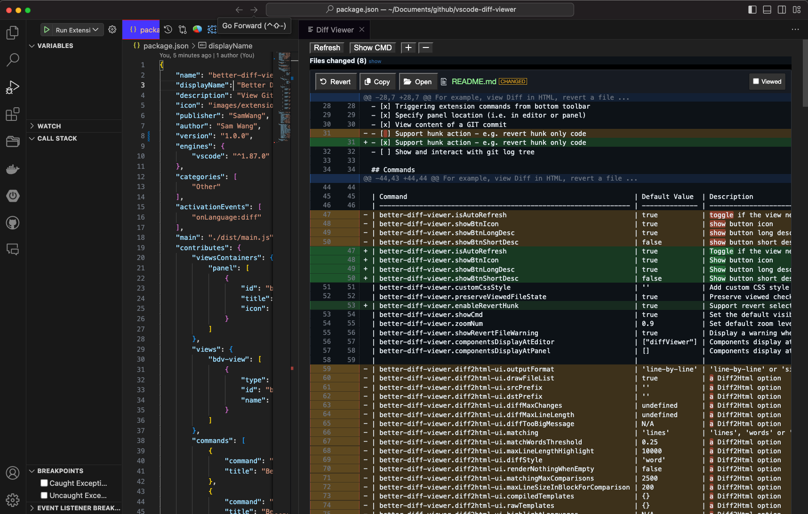

# Better Diff Viewer

View Git diff in a colorful HTML page via [Diff2Html-UI](https://github.com/rtfpessoa/diff2html).

### Dark Mode (v0.0.8)

### Light Mode (v0.0.1)

## Rationale

Creating a similar diff view panel to [Source Tree](https://www.sourcetreeapp.com).
The aim is to add most of the features which [Source Tree](https://www.sourcetreeapp.com) diff viewer can do.
For example, view Diff in HTML, revert a file ...

## Features

- [x] View .diff/.patch or git diff in Diff2HTML-UI
- [x] View diff for uncommitted changes
- [x] Dark/light/auto mode support
- [x] Diff2Html-UI user configurable settings
- [x] Trigger content refresh manually
- [x] Open a file in editor
- [x] Revert a file
- [x] Copy file path
- [x] Toggle show/hide the command (i.e., git command), which was used to generate the diff result
- [x] Support custom styling - better support for unknown themes
- [x] Support custom user commands, which can be defined by user
- [x] Store users view actions (i.e., remember viewed button for files)
- [x] Zoom in/out
- [x] Triggering extension commands from bottom toolbar
- [x] Specify panel location (i.e. in editor or panel)
- [x] View content of a GIT commit
- [x] Support hunk action - e.g. revert hunk only code
- [ ] Show and interact with git log tree

## Commands

- `better-diff-viewer.viewDiffFile`: view diff for current .diff/.patch file
- `better-diff-viewer.viewRepoGitDiff`: view Git diff for current repository
- `better-diff-viewer.viewGitDiffForFile`: view Git diff for current file
- `better-diff-viewer.viewCustomDiffFromCmd`: View Diff from a custom command on current repository
- `better-diff-viewer.viewChangesInCommit`: View Changes in selected commit
- `better-diff-viewer.viewChangesBetweenCommits`: View Changes between selected commits

## Settings

| Command                                                         | Default Value  | Description                                                                                                                  |
| --------------------------------------------------------------- | -------------- | ---------------------------------------------------------------------------------------------------------------------------- |
| better-diff-viewer.isAutoRefresh                                | true           | Toggle if the view needs to be refreshed when any file get saved                                                             |
| better-diff-viewer.showBtnIcon                                  | true           | Show button icon                                                                                                             |
| better-diff-viewer.showBtnLongDesc                              | true           | Show button long description                                                                                                 |
| better-diff-viewer.showBtnShortDesc                             | false          | Show button short description (for saving spaces)                                                                            |
| better-diff-viewer.customCssStyle                               | ''             | Add custom CSS style for the diff viewer. Please add in one line. For example: ".d2h-file-name{color:cyan !important;}"      |
| better-diff-viewer.preserveViewedFileState                      | true           | Preserve viewed checkbox state after diff viewer refresh                                                                     |
| better-diff-viewer.enableRevertHunk                             | true           | Support revert selected hunk                                                                                                 |
| better-diff-viewer.showCmd                                      | true           | Set the default visibility of the command which used to generate the diff output. The cmd is shown at the bottom of the page |
| better-diff-viewer.zoomNum                                      | 0.9            | Set default zoom level for the viewer                                                                                        |
| better-diff-viewer.showRevertFileWarning                        | true           | Display a warning when reverting a file                                                                                      |
| better-diff-viewer.componentsDisplayAtEditor                    | ["diffViewer"] | Components display at editor section - reload required                                                                       |
| better-diff-viewer.componentsDisplayAtPanel                     | []             | Components display at panel section - reload required                                                                        |
|                                                                 |                |                                                                                                                              |
| better-diff-viewer.diff2html-ui.outputFormat                    | 'line-by-line' | 'line-by-line' or 'side-by-side'; A Diff2Html option                                                                         |
| better-diff-viewer.diff2html-ui.drawFileList                    | true           | A Diff2Html option                                                                                                           |
| better-diff-viewer.diff2html-ui.srcPrefix                       | ''             | A Diff2Html option                                                                                                           |
| better-diff-viewer.diff2html-ui.dstPrefix                       | ''             | A Diff2Html option                                                                                                           |
| better-diff-viewer.diff2html-ui.diffMaxChanges                  | undefined      | A Diff2Html option                                                                                                           |
| better-diff-viewer.diff2html-ui.diffMaxLineLength               | undefined      | A Diff2Html option                                                                                                           |
| better-diff-viewer.diff2html-ui.diffTooBigMessage               | N/A            | A Diff2Html option                                                                                                           |
| better-diff-viewer.diff2html-ui.matching                        | 'lines'        | 'lines', 'words' or 'none'; A Diff2Html option                                                                               |
| better-diff-viewer.diff2html-ui.matchWordsThreshold             | 0.25           | A Diff2Html option                                                                                                           |
| better-diff-viewer.diff2html-ui.maxLineLengthHighlight          | 10000          | A Diff2Html option                                                                                                           |
| better-diff-viewer.diff2html-ui.diffStyle                       | 'word'         | A Diff2Html option                                                                                                           |
| better-diff-viewer.diff2html-ui.renderNothingWhenEmpty          | false          | A Diff2Html option                                                                                                           |
| better-diff-viewer.diff2html-ui.matchingMaxComparisons          | 2500           | A Diff2Html option                                                                                                           |
| better-diff-viewer.diff2html-ui.maxLineSizeInBlockForComparison | 200            | A Diff2Html option                                                                                                           |
| better-diff-viewer.diff2html-ui.compiledTemplates               | {}             | A Diff2Html option                                                                                                           |
| better-diff-viewer.diff2html-ui.rawTemplates                    | {}             | A Diff2Html option                                                                                                           |
| better-diff-viewer.diff2html-ui.highlightLanguages              | N/A            | A Diff2Html option                                                                                                           |
|                                                                 |                |                                                                                                                              |
| better-diff-viewer.diff2html-ui.colorScheme                     | 'auto'         | 'light', 'dark' or 'auto'; A Diff2Html option values. The 'auto' will use the VSCode color schema                            |
| better-diff-viewer.diff2html-ui.synchronisedScroll              | true           | A Diff2HtmlUI option                                                                                                         |
| better-diff-viewer.diff2html-ui.highlight                       | true           | A Diff2HtmlUI option                                                                                                         |
| better-diff-viewer.diff2html-ui.fileListToggle                  | true           | A Diff2HtmlUI option                                                                                                         |
| better-diff-viewer.diff2html-ui.fileListStartVisible            | false          | A Diff2HtmlUI option                                                                                                         |
| better-diff-viewer.diff2html-ui.fileContentToggle               | true           | A Diff2HtmlUI option                                                                                                         |
| better-diff-viewer.diff2html-ui.stickyFileHeaders               | true           | A Diff2HtmlUI option                                                                                                         |

## Installation

[Install from Visual Studio Marketplace](https://marketplace.visualstudio.com/items?itemName=SamWang.better-diff-viewer)

## Thanks to Diff2Html

[Goto Diff2Html](https://github.com/rtfpessoa/diff2html)

## Author

Sam Wang - [https://liveinaus.com](https://liveinaus.com)

## LICENSE

GNU General Public License v3.0

**Enjoy!**
